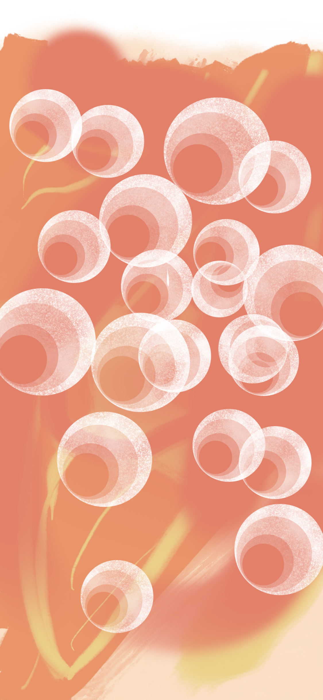
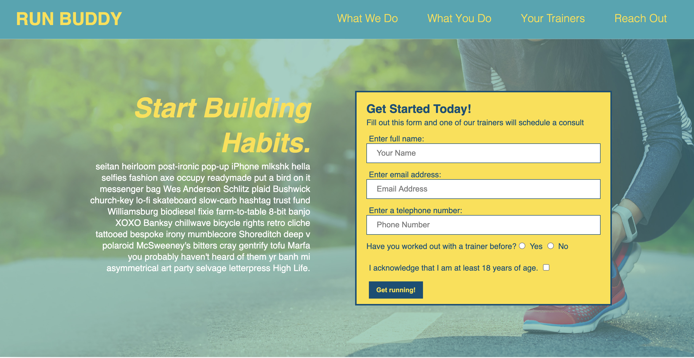

# Mario Viana Portfolio

The following portfolio is designed under the HTML and CSS code programs, it is giving all 
the historical overview of the different software in which I have programmed and used for their development. 
The page has a browser that will take you to the different parts of the page, it also has a graphic
area where you will see the programs developed and the results of some. Also the page has a footer
 where you will find the different links to contact me. I hope you like them and that we can share 
 a little more to talk about the other developers that I can use, thanks for paying attention to my portfolio 
 and I hope that we will be in contact soon.

  

 
